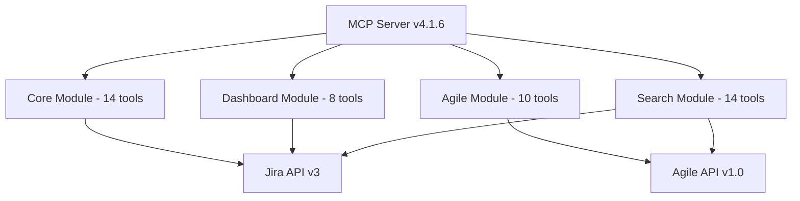
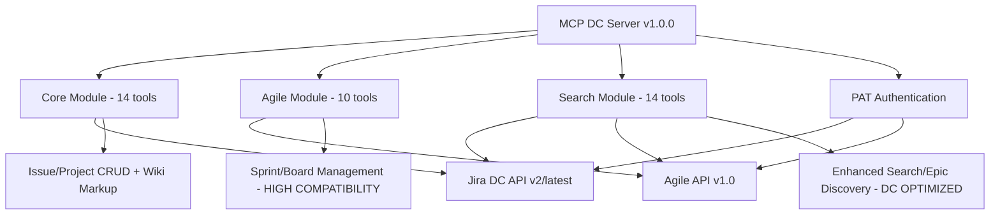

# MCP Jira Data Center Server - Implementation Details

> **Current Version**: 1.0.0-DC (Development Ready)  
> **Source Version**: Cloud v4.1.6 (Production Baseline)  
> **Architecture**: 3 specialized modules với PAT-only authentication  
> **Implementation Strategy**: Systematic migration với Data Center API optimization và 3-module focus

---

## 🏢 Technical Architecture

### 1. Core Architecture Transformation

**Source Cloud v4.1.6 Architecture**:


**Target Data Center v1.0.0-DC Architecture**:


### 2. PAT-Only Authentication Pattern

**Authentication Implementation**:
```typescript
// PAT-only authentication strategy
interface JiraDataCenterConfig {
  baseUrl: string;                    // e.g., "https://jira.company.com"
  personalAccessToken: string;        // PAT from DC 8.14+
  apiVersion: 'latest' | '2';         // Default: 'latest'
  contextPath?: string;               // e.g., "/jira" if custom context
  timeout: number;                    // Default: 30000ms
  maxRetries: number;                 // Default: 3
}

// Simplified server registration (v1.0.0-DC)
const server = new McpServer({
  name: 'mcp-jira-dc-server',
  version: '1.0.0-DC',
  capabilities: {
    tools: {}  // 38 DC-adapted tools (46 - 8 Dashboard tools)
  }
});

// Module-specific entry points available:
// - mcp-jira-dc-core (14 tools - Essential operations)
// - mcp-jira-dc-agile (10 tools - Sprint/Board management, HIGH COMPATIBILITY) 
// - mcp-jira-dc-search (14 tools - Enhanced search, DC-optimized performance)

// PAT Authentication header
const dcHeaders = {
  'Authorization': `Bearer ${personalAccessToken}`,
  'Content-Type': 'application/json',
  'Accept': 'application/json',
  'X-Atlassian-Token': 'no-check'
};
```

### 3. API Endpoint Adaptation Strategy

**Endpoint Mapping Implementation**:
```typescript
class DataCenterApiClient {
  private baseUrl: string;
  private apiVersion: string;
  private auth: PATAuthenticator;
  
  constructor(config: JiraDataCenterConfig) {
    this.baseUrl = config.baseUrl.replace(/\/$/, '') + (config.contextPath || '');
    this.apiVersion = config.apiVersion || 'latest';
    this.auth = new PATAuthenticator(config.personalAccessToken);
  }
  
  getEndpoint(cloudEndpoint: string): string {
    const mappings = {
      // Core API version mapping
      '/rest/api/3/': `/rest/api/${this.apiVersion}/`,
      
      // Specific endpoint adaptations
      '/rest/api/3/users': `/rest/api/${this.apiVersion}/user/search`,
      '/rest/api/3/project/{key}/version': `/rest/api/${this.apiVersion}/project/{key}/versions`,
      
      // Dashboard module removed - no mappings needed
      
      // Agile API - no changes needed (HIGH COMPATIBILITY)
      '/rest/agile/1.0/': '/rest/agile/1.0/'
    };
    
    let dcEndpoint = cloudEndpoint;
    for (const [pattern, replacement] of Object.entries(mappings)) {
      if (cloudEndpoint.includes(pattern)) {
        dcEndpoint = cloudEndpoint.replace(pattern, replacement);
        break;
      }
    }
    
    return `${this.baseUrl}${dcEndpoint}`;
  }
  
  // Content format converter
  convertContentFormat(adfContent: any): string {
    if (typeof adfContent === 'string') return adfContent;
    if (adfContent?.type === 'doc') {
      // Convert ADF to Wiki Markup
      return this.adfToWikiMarkup(adfContent);
    }
    return JSON.stringify(adfContent);
  }
  
  // User resolution strategy
  async resolveUser(identifier: string): Promise<string> {
    // Try accountId first, fallback to username for DC
    if (identifier.includes(':')) {
      // accountId format
      return identifier;
    } else {
      // username format - DC native
      return identifier;
    }
  }
}
```

---

## 📂 Target File Structure

### Data Center Structure Design
```
src/
├── index.ts - Main server (DC API v2/latest, 38 tools total)
├── modules/ - 3 Specialized Modules (Dashboard removed)
│   ├── core/
│   │   ├── index.ts - Core module server (14 tools)
│   │   └── tools/ - Issue/Project/User/Comment CRUD operations
│   │       ├── create-issue.ts - Wiki Markup support
│   │       ├── update-issue.ts - Wiki Markup format
│   │       ├── add-issue-comment.ts - Native Wiki Markup
│   │       ├── list-users.ts - DC endpoint adaptation
│   │       ├── list-project-versions.ts - Endpoint changed
│   │       └── [9 other core tools]
│   ├── agile/
│   │   ├── index.ts - Agile module server (10 tools, HIGH COMPATIBILITY)
│   │   └── tools/ - Sprint/Board lifecycle (minimal changes)
│   │       ├── list-boards.ts - No changes needed
│   │       ├── create-sprint.ts - No changes needed
│   │       ├── start-sprint.ts - No changes needed
│   │       └── [7 other agile tools - all unchanged]
│   └── search/
│       ├── index.ts - Search module server (14 tools, DC ENHANCED)
│       └── tools/ - Enhanced search, Epic discovery
│           ├── enhanced-search-issues.ts - DC optimized
│           ├── epic-search-agile.ts - Better DC support
│           ├── universal-search-users.ts - Enhanced DC version
│           └── [11 other search tools]
├── tools/jira/ - Legacy monolithic tools (38 DC-adapted tools)
│   ├── enhanced-search-issues.ts - Cloud enhanced version adapted
│   ├── enhanced-get-issue.ts - Cloud enhanced version adapted
│   ├── universal-search-users.ts - DC username support
│   ├── list-sprints.ts - From Cloud consolidation
│   ├── epic-search-agile.ts - Enhanced for DC
│   └── [33 other DC-adapted tools]
├── utils/
│   ├── jira-dc-api.ts - Unified Data Center API client
│   ├── jira-dc-agile-api.ts - Agile API client (minimal changes)
│   ├── pat-authenticator.ts - PAT authentication handling
│   ├── content-formatter.ts - Wiki Markup ↔ ADF conversion
│   ├── endpoint-mapper.ts - Cloud → DC endpoint mapping
│   ├── error-handler.ts - DC-specific error mapping
│   └── logger.ts - Structured logging
├── schemas/
│   ├── jira-dc.ts - DC schemas với username/accountId dual support
│   └── common.ts - Shared validation schemas
├── config/
│   └── datacenter-config.ts - DC configuration management
└── core/
    ├── server-base.ts - Shared server infrastructure
    └── utils/module-types.ts - Module type definitions
```

---

## ✅ Implementation Phases

### Phase 1: Authentication & Infrastructure (Week 1-2)
- PAT authentication implementation với enterprise security
- Base URL và context path detection
- API version negotiation (latest/v2)
- Configuration validation và error handling

**Key Deliverables**:
```typescript
// PAT Authentication validator
class PATValidator {
  async validateToken(baseUrl: string, token: string): Promise<boolean> {
    const response = await fetch(`${baseUrl}/rest/api/2/myself`, {
      headers: { 'Authorization': `Bearer ${token}` }
    });
    return response.ok;
  }
}

// Configuration manager
class DataCenterConfigManager {
  validateConfig(config: JiraDataCenterConfig): ValidationResult {
    // Validate PAT format, base URL, context path
  }
}
```

### Phase 2: API Client Adaptation (Week 3-4)  
- Endpoint mapping implementation
- Content format conversion utilities (ADF → Wiki Markup)
- User resolution strategies (accountId ↔ username)
- Error response mapping và handling

**Key Deliverables**:
```typescript
// Content format converter
class ContentConverter {
  adfToWikiMarkup(adf: any): string {
    // Convert ADF to Wiki Markup for DC compatibility
  }
  
  wikiMarkupToPlainText(wikiText: string): string {
    // Fallback conversion for simple display
  }
}

// User resolver
class UserResolver {
  async resolveUserIdentifier(identifier: string, context: 'accountId' | 'username'): Promise<User> {
    // Handle both username and accountId for DC compatibility
  }
}
```

### Phase 3: Tool Migration (Week 5-8)

**Phase 3.1: Agile Module (Week 5) - HIGH COMPATIBILITY**
- 10 tools với minimal changes needed
- Agile API v1.0 unchanged between Cloud và DC
- Quick wins với highest success probability

**Phase 3.2: Core Module (Week 6) - MODERATE CHANGES**
- 14 tools với API version changes và endpoint adaptations
- Wiki Markup support implementation
- Username/accountId dual resolution

**Phase 3.3: Search Module (Week 7) - DC ENHANCED**
- 14 tools với enhanced capabilities
- Epic search improvement via Agile API
- Performance optimization for DC deployment

### Phase 4: Testing & Optimization (Week 9-10)
- Unit testing với mock DC responses
- Integration testing với real Data Center instances
- Performance benchmarking và optimization
- Security audit và PAT handling review

**Testing Framework**:
```typescript
describe('DC Tool Migration', () => {
  let dcClient: DataCenterApiClient;
  
  beforeEach(() => {
    dcClient = new DataCenterApiClient({
      baseUrl: 'https://test-jira-dc.company.com',
      personalAccessToken: 'test-pat-token',
      apiVersion: 'latest'
    });
  });
  
  describe('Agile Module - High Compatibility', () => {
    it('should list boards without changes', async () => {
      // Test Agile API compatibility
    });
    
    it('should create sprint without changes', async () => {
      // Test sprint creation
    });
  });
  
  describe('Core Module - API Adaptations', () => {
    it('should handle Wiki Markup in comments', async () => {
      // Test Wiki Markup support
    });
    
    it('should resolve users by username', async () => {
      // Test username support
    });
  });
});
```

---

## 🎯 Migration Strategy

### Dashboard Module Removal Rationale
- Dashboard API patterns differ significantly between Cloud và DC
- Analytics functionality often custom per DC instance
- Focus on core productivity tools (Issues, Sprints, Search)
- **Result**: 46 tools → 38 tools (8 dashboard tools removed)

### Content Format Strategy
```typescript
// Content format adaptation
interface ContentFormatHandler {
  // Primary format for DC
  toWikiMarkup(content: any): string;
  
  // Fallback format  
  toPlainText(content: any): string;
  
  // Format detection
  detectFormat(content: string): 'wikimarkup' | 'adf' | 'plaintext';
  
  // Graceful conversion
  convertSafely(content: any, targetFormat: string): string;
}
```

### User Resolution Strategy
```typescript
// DC User resolution
class DCUserManager {
  async findUser(query: string): Promise<User[]> {
    // Try multiple strategies:
    // 1. accountId lookup
    // 2. username search  
    // 3. email search
    // 4. display name search
  }
  
  async resolveForAssignment(identifier: string): Promise<string> {
    // Return appropriate identifier for issue assignment
    // DC supports both accountId and username
  }
}
```

---

## 📊 Success Metrics - TARGET v1.0.0-DC

### Technical Metrics 📋 PLANNED
- ✅ **PAT Authentication**: Single, secure authentication method
- ✅ **Tool Compatibility**: 38/38 tools operational với Data Center APIs
- ✅ **Performance**: Sub-500ms response times maintained from Cloud version  
- ✅ **API Coverage**: Complete Data Center API v2/latest + Agile v1.0 support
- ✅ **Content Handling**: Native Wiki Markup support với ADF fallback

### Quality Metrics 📋 PLANNED
- ✅ **Consistent Patterns**: All tools follow DC-adapted patterns
- ✅ **Error Handling**: Comprehensive DC-specific error mapping
- ✅ **Documentation**: Complete API reference cho Data Center users
- ✅ **Integration Testing**: Real DC instance validation

### User Experience 📋 PLANNED  
- ✅ **Configuration Simplicity**: Single PAT setup
- ✅ **Migration Support**: Clear upgrade path từ Cloud version
- ✅ **Enterprise Ready**: Support cho corporate network configurations
- ✅ **Self-Hosted Optimized**: Performance tuning cho on-premises deployment

### Security & Compliance 📋 PLANNED
- ✅ **PAT Security**: Best practices cho token handling
- ✅ **Network Security**: Corporate firewall compatibility
- ✅ **Audit Trail**: Comprehensive logging cho enterprise compliance
- ✅ **Token Management**: Clear token lifecycle management

---

## 🚀 DC-Specific Advantages over Cloud

### **Simplified Authentication**
- Single PAT method vs Cloud's multiple auth strategies (Basic, API Token, OAuth)
- Better enterprise security compliance
- No credential storage requirements
- Simplified configuration management

### **Enhanced Performance**  
- Direct network access vs internet routing
- Dedicated resources vs shared cloud infrastructure
- Custom caching strategies vs cloud limitations
- Lower latency với on-premises deployment

### **Enterprise Features**
- LDAP/AD user integration support
- Custom fields và workflow compatibility
- On-premises data sovereignty
- Corporate network firewall compatibility

### **Content Flexibility**
- Native Wiki Markup support (better than Cloud's ADF requirement)
- Plain text fallback for simplicity
- Better rich text handling
- Custom field format support

---

## 🏆 Final Architecture Benefits

**3-Module Architecture**:
- **Core Module**: Essential operations với moderate API changes
- **Agile Module**: High compatibility (minimal changes needed)
- **Search Module**: Enhanced capabilities với DC optimization

**PAT-Only Authentication**:
- Simplified setup vs Cloud's multiple auth methods
- Enterprise security compliance
- Better token lifecycle management

**Content Native Support**:
- Wiki Markup first-class citizen
- Graceful format conversion
- Better user experience cho DC environments

**Performance Optimized**:
- Direct API access
- Dedicated infrastructure
- Custom optimization opportunities

---

_Document Status: Implementation Planning Complete ✅_  
_Last Updated: 2025-08-14 - Comprehensive DC Migration Strategy_  
_Status: Development Ready với 3-Module Architecture và PAT Authentication_