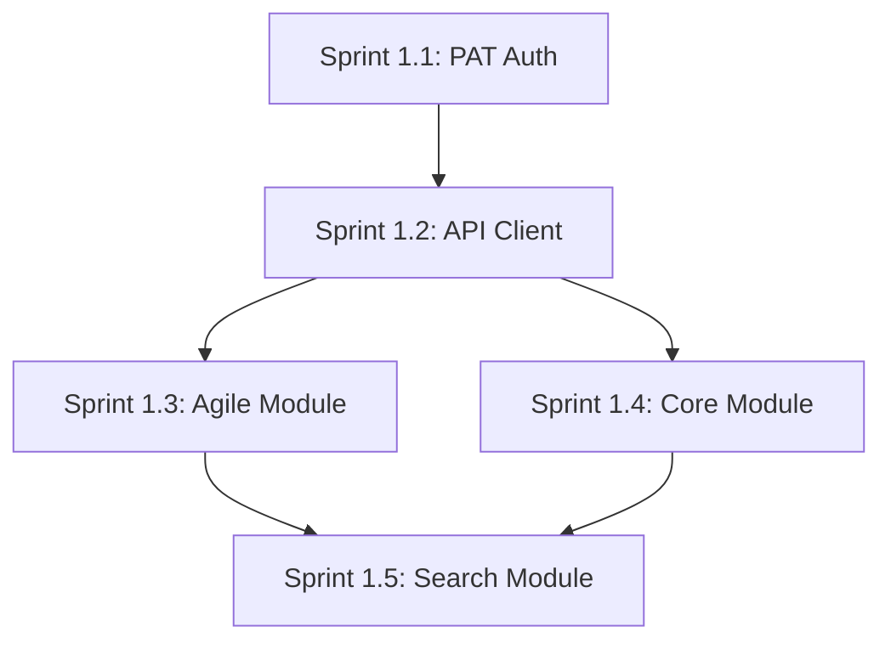

# MCP Jira Data Center Server - Implementation Sprint Overview

> **Project**: MCP Jira Data Center Server v1.0.0-DC  
> **Phase**: Implementation (02_implementation)  
> **Timeline**: 4 Sprints x 2 weeks = 8 weeks development  
> **Target**: Production-ready DC server với 38 tools và PAT authentication

---

## 🎯 Sprint Structure Overview

### Development Strategy
- **Sprint Length**: 2 weeks per sprint
- **Focus**: Systematic migration từ Cloud architecture sang Data Center
- **Approach**: Foundation-first, then high-compatibility modules
- **Testing**: Continuous integration với real DC instances

### Sprint Breakdown

| Sprint | Duration | Focus | Deliverables | Tools Count |
|--------|----------|-------|--------------|-------------|
| **Sprint 1.1** | Week 1-2 | PAT Auth & Infrastructure | Foundation + Config | Base framework |
| **Sprint 1.2** | Week 3-4 | API Client Adaptation | DC endpoint mapping | API clients ready |
| **Sprint 1.3** | Week 5-6 | Agile Module (HIGH COMPAT) | 10 working tools | 10/38 tools ✅ |
| **Sprint 1.4** | Week 7-8 | Core Module Migration | 14 working tools | 24/38 tools ✅ |
| **Sprint 1.5** | Week 9-10 | Search Module & Testing | 14 working tools | 38/38 tools ✅ |

---

## 📊 Success Metrics per Sprint

### Sprint 1.1 - Foundation
- ✅ PAT authentication working với real DC instance
- ✅ Configuration management complete
- ✅ Base URL detection và context path support
- ✅ Error handling framework established

### Sprint 1.2 - API Adaptation  
- ✅ Cloud → DC endpoint mapping functional
- ✅ Content format conversion (ADF → Wiki Markup)
- ✅ User resolution strategy implemented
- ✅ API client library complete

### Sprint 1.3 - Agile Module
- ✅ 10/10 Agile tools operational (HIGH COMPATIBILITY)
- ✅ Real DC testing với Sprint/Board operations
- ✅ Performance benchmarks met (<500ms)
- ✅ Integration tests passing

### Sprint 1.4 - Core Module
- ✅ 14/14 Core tools operational (Issues/Projects/Users)
- ✅ Wiki Markup support trong comments
- ✅ Username/accountId dual resolution
- ✅ CRUD operations validated

### Sprint 1.5 - Search & Final
- ✅ 14/14 Search tools operational với Epic discovery
- ✅ All 38 tools tested và documented
- ✅ Performance optimization complete
- ✅ Production deployment ready

---

## 🚀 Key Implementation Priorities

### 1. Authentication First
**Rationale**: PAT authentication là foundation cho tất cả API calls
- Enterprise security compliance
- Single authentication method simplicity
- Token validation và lifecycle management

### 2. High-Compatibility Modules Early
**Rationale**: Agile API v1.0 unchanged → quick wins
- Boost development confidence  
- Early user feedback opportunities
- Risk mitigation strategy

### 3. Content Format Support
**Rationale**: Wiki Markup là native format cho DC
- Better user experience vs ADF
- Improved compatibility với DC instances
- Graceful fallback strategies

### 4. Performance Throughout
**Rationale**: Maintain Cloud v4.1.6 performance standards
- Sub-500ms response time target
- Efficient endpoint mapping
- Optimized DC-specific features

---

## 🔧 Technical Dependencies

### Sprint Dependencies


### Infrastructure Requirements
- **Development DC Instance**: For testing và validation
- **PAT Generation**: Admin access cho token creation
- **Network Access**: Corporate firewall configuration
- **Testing Framework**: Jest + real API integration

---

## 📋 Risk Management

### High Risk Items
- **PAT Token Limitations**: Some DC versions có restricted PAT features
- **API Version Compatibility**: Latest vs v2 endpoint differences  
- **Content Format Conversion**: Complex ADF → Wiki Markup edge cases
- **Corporate Network**: Firewall và proxy configurations

### Mitigation Strategies
- **Early Validation**: Test PAT authentication trong Sprint 1.1
- **API Fallbacks**: Support both 'latest' và 'v2' API versions
- **Content Graceful Degradation**: Plain text fallback for complex content
- **Network Testing**: Corporate environment validation early

---

## 🎯 Sprint Deliverables Overview

### Modular Architecture Support
Each sprint delivers:
- **Monolithic Entry Point**: Full backward compatibility
- **Module-Specific Entry**: Optimized specialized deployment
- **Testing Suite**: Comprehensive coverage
- **Documentation**: API reference và usage examples

### Quality Gates
- **Code Quality**: TypeScript strict mode, ESLint clean
- **Test Coverage**: >90% coverage for all modules  
- **Performance**: <500ms response times maintained
- **Security**: PAT handling best practices
- **Documentation**: Complete API reference

---

## 📚 Sprint Documentation Structure

```
docs/02_implementation/
├── sprint_overview.md (this file)
├── sprint_1_1_foundation.md - PAT Auth & Infrastructure  
├── sprint_1_2_api_client.md - DC API Client Adaptation
├── sprint_1_3_agile_module.md - High-Compatibility Module
├── sprint_1_4_core_module.md - Essential CRUD Operations
├── sprint_1_5_search_final.md - Search Module & Production Ready
└── implementation_progress.md - Cross-sprint tracking
```

---

## 🏆 Final Success Definition

**Version 1.0.0-DC Production Ready**:
- ✅ **All 38 tools operational** với Data Center API compatibility
- ✅ **PAT-only authentication** working với enterprise security
- ✅ **3-module architecture** deployed và tested
- ✅ **Performance targets met** (<500ms average response)
- ✅ **Documentation complete** với migration guide từ Cloud
- ✅ **Real DC validation** với multiple instance types

**Migration Benefits Achieved**:
- **Simplified Setup**: Single PAT vs multiple Cloud auth methods
- **Enhanced Performance**: Direct network access vs internet routing  
- **Enterprise Ready**: Corporate network và security compliance
- **Content Native**: Wiki Markup support cho better UX

---

_Document Created: August 14, 2025_  
_Implementation Phase: Ready to Begin_  
_Next Action: Proceed to Sprint 1.1 Foundation Setup_